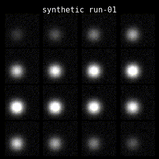

# bold-reliability-movies

BIDS-aware BOLD reliability movies for visual fMRI QC. Cycle through the mean image of every BOLD run for a subject to spot dropout, drift, and across-run instability at a glance.

Inspired by Kendrick Kay's NSD inspection videos (`cvnlab/nsddatapaper/mainfigures/INSPECTIONS/GRANDVISUALIZATION`). This package is **not** a port of that code: it is a Python implementation that ships a volume-space mosaic renderer by default and exposes a `Renderer` Protocol so a flatmap (or any other) backend can be written by a third party.

## Install

### With uv (recommended)
```bash
uv tool install bold-reliability-movies   # CLI available globally as `brm`
# or, in a project:
uv add bold-reliability-movies
```

### With pip + venv
```bash
python -m venv .venv && source .venv/bin/activate
pip install bold-reliability-movies
```

### With pip (system Python — not recommended outside containers)
```bash
pip install --user bold-reliability-movies
```

### System dependency: ffmpeg
- macOS: `brew install ffmpeg`
- Ubuntu/Debian: `sudo apt install ffmpeg`
- Conda: `conda install -c conda-forge ffmpeg`
- HPC modules: `module load ffmpeg`

### From source (development)
```bash
git clone https://github.com/lobennett/bold-reliability-movies
cd bold-reliability-movies
uv sync --dev          # uv flow
# or
pip install -e ".[dev]"  # pip flow
```

## Quickstart

```bash
# One video per subject, mosaic renderer, 2 fps
brm bids /path/to/fmriprep/derivatives --out movies/

# Filter to one task, group by subject+session
brm bids /path/to/fmriprep/derivatives --out movies/ \
    --filter task=rest --group-by subject+session

# Custom inputs via TSV manifest
brm list manifest.tsv --out movies/

# Render an arbitrary list of NIfTIs into one video
brm render run1.nii.gz run2.nii.gz run3.nii.gz --out movie.mp4 \
    --labels "ses-01 run-1" "ses-01 run-2" "ses-02 run-1"
```

## Example output

The animation below was produced by `examples/synthetic_demo.py` — synthetic 4D NIfTIs with a Gaussian blob that drifts position across runs, mosaic renderer, 2 fps, GIF codec.



To regenerate locally:
```bash
uv run python examples/synthetic_demo.py
```

## Manifest format (`brm list`)

```
path	label	group	sort_key
/data/sub-01_ses-01_run-1.nii.gz	ses-01 run-1	sub-01	1
/data/sub-01_ses-01_run-2.nii.gz	ses-01 run-2	sub-01	2
```
- `path`, `label`, `group` required.
- `sort_key` optional; absent → row order preserved.
- Lines starting with `#` ignored.

## Custom renderers

A renderer is any callable matching the `Renderer` Protocol:

```python
import nibabel as nib
import numpy as np
from pathlib import Path
from bold_reliability_movies import Frame, FrameGroup, make_video

def my_renderer(mean_img: nib.Nifti1Image, label: str) -> np.ndarray:
    """Return (H, W, 3) uint8. H, W must be constant across calls."""
    data = mean_img.get_fdata()
    # ... your rendering ...
    return rgb_uint8

group = FrameGroup(
    name="sub-s03",
    frames=[Frame(path=Path("run1.nii.gz"), label="ses-01 run-1", sort_key=(1,))],
)
make_video(group, renderer=my_renderer, out_path=Path("sub-s03.mp4"), fps=2)
```

To make your renderer visible to the `brm` CLI, register it in `src/bold_reliability_movies/renderers/__init__.py` and submit a PR. (External plugin loading via setuptools entry points will land when there's a real plugin author asking for it.)

## CLI exit codes

- `0` — success
- `1` — partial failure (some groups skipped or had dropped frames)
- `2` — misconfiguration (missing dep, bad arg, unknown renderer)
- `3` — no work found (empty discovery)

## Attribution

The "BOLD reliability movie" idea originates with Kendrick Kay (cvnlab), who showed per-session mean-BOLD videos at his Stanford talk and built the canonical version (an fsaverage flat-surface projection, MATLAB) inside the [NSD data paper](https://github.com/cvnlab/nsddatapaper) at `mainfigures/INSPECTIONS/GRANDVISUALIZATION/GRANDVISUALIZATIONnotes.m`. This package implements the same *concept* (cycle mean BOLD across runs for visual QC) in BIDS-Python form with a different default rendering. It does not reproduce his exact output.

## License

MIT. See `LICENSE`.

## Design

See `docs/superpowers/specs/2026-04-27-bold-reliability-movies-design.md` for the full architecture and decision record.
